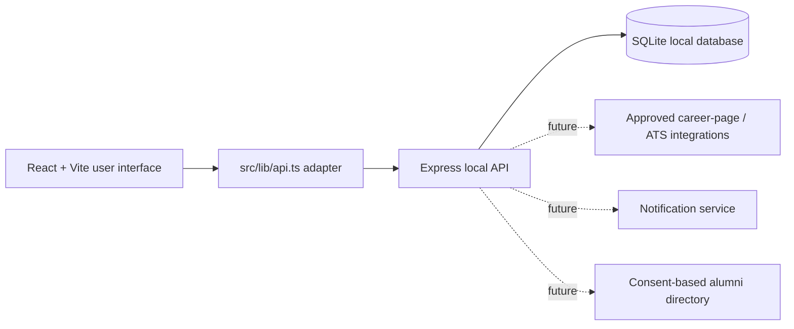

# Pratham — Skill to Opportunity, First, Always

Pratham is a Smart India Hackathon prototype that helps students find genuine, skill-relevant opportunities before they become overcrowded. It also gives academics, employers, and institutions a shared view of the journey from skill development to outcomes.

## The demo in one minute

1. Open **Student** and watch First-Hour Radar verify and assess opportunities.
2. Select a role to see its score explanation and available Insider Connect paths.
3. Paste resume text to extract recognised skills; the match scores immediately recalculate.
4. Open **Industry** and publish a role. It is saved to the local database.
5. Refresh the page or open Student in a second tab: the same role is still visible.
6. Download a role match report or view Institution analytics for the wider impact story.

## Architecture



`src/lib/api.ts` is the deliberate integration boundary. A future production system can replace local endpoints with approved integrations without rebuilding the user interface.

## How the core logic works

### Match scoring

`src/lib/matching.ts` computes every score from the active student profile and the role’s required skills:

- **Skills score (58%)**: percentage of required skills present in the profile.
- **Experience score (25%)**: difference between the student’s stated experience and role requirement.
- **Timing score (17%)**: a combination of job freshness and remaining application capacity.

The final score is classified as Exceptional (90+), Strong (75–89), Potential (55–74), or Growth (below 55). Select **Why this score?** on any role to see the matched skills, missing skills, and timing contribution.

### Resume-to-skills extraction

The resume box uses a maintained technology-skills taxonomy and real local text matching. It is not an AI resume parser: it recognises skills visibly present in pasted text, adds them to the student profile, and recalculates all scores. This makes it reliable, transparent, and testable during a demo.

### Persistence and shared data

The Express server writes roles to `pratham-demo.db` using SQLite. Industry publishing calls `POST /api/roles`; the Student view reads `GET /api/roles` and refreshes periodically. This means roles survive refreshes and can be seen in multiple browser tabs.

## What each persona can do

| Persona | Purpose |
| --- | --- |
| Student | Discover early roles, inspect defensible matches, personalise skills, download reports, and request an introduction. |
| Industry | Publish an opportunity to the persistent local Watch Bot feed and see an example ranked-candidate view. |
| Academician | List FDP, consultancy, and research opportunities and communicate mentorship outcomes. |
| Institution | See readiness, role-fit improvement, participation, partner activity, placement trends, and skill gaps. |

## What's real vs simulated

| Real in this build | Simulated for the local demo |
| --- | --- |
| Deterministic skills/experience/timing scoring | Internet-facing career-page scraping and ATS connections |
| Rule-driven verification states in the local role flow | Actual company verification responses |
| Express REST API and SQLite persistence | Push notifications and real emails |
| Cross-tab data visibility through shared local database | Real alumni/referral directory data |
| Search, filters, sorting, resume text extraction, and PDF reports | Real user accounts and production portfolio credentials |

All companies and people shown are demo fixtures. The app never contacts a real person.

## Run locally

Requirements: Node.js 20 or later.

```bash
npm install
npm run dev
```

This one command starts both services:

- Website: `http://localhost:5173`
- Local API: `http://localhost:5174/api/health`

Create a production frontend bundle with:

```bash
npm run build
```

## Key files

- `server/index.js` — Express API, SQLite schema, seed data, and persistent role publishing.
- `src/lib/api.ts` — frontend/backend adapter.
- `src/lib/matching.ts` — transparent scoring logic.
- `src/lib/extractSkills.ts` — local resume text skill extraction.
- `src/main.tsx` — screens and interactive demo flow.

## Production path

The next production steps are approved ATS/career-page connectors, authenticated accounts, consent-led alumni network integration, auditable portfolio evidence, proper notification delivery, and role-based access controls. Pratham’s present local API and adapter are intentionally structured as a practical first step toward those integrations.

## v3: Eligibility and targeted Watch Bot

After pasting resume text, Pratham now ranks six seeded role archetypes (ML, frontend, backend, data, DevOps, and QA) as **Eligible**, **Close**, or **Not yet ready**. The explanation reuses the same `computeMatch` calculation used in the role feed, so there is one defensible scoring model throughout the product.

Students can choose only from the demo’s seeded companies and archetypes, then create a persistent Watch subscription. `server/index.js` runs a real scheduled crawler every **30 seconds** (`CRAWL_INTERVAL_MS`) against a seeded career-feed cycle. This compressed interval is an honest demonstration substitute for the intended real-world continuous / within-an-hour cadence. Matching active watches create real SQLite notification records and are pushed to open Student screens through Server-Sent Events (SSE), without a page refresh.
